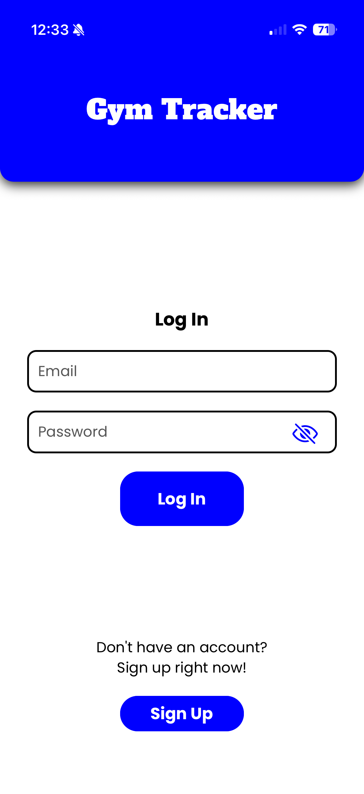
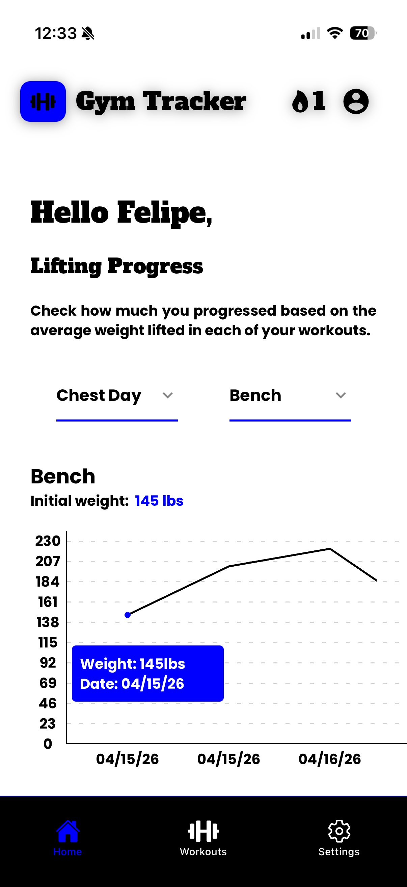
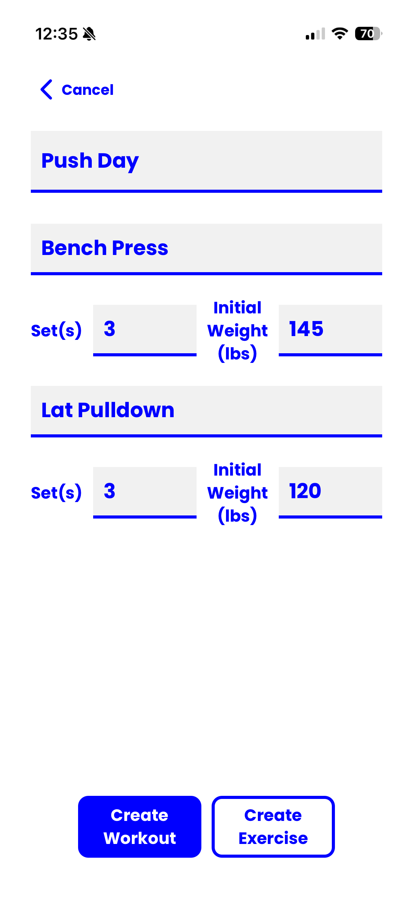
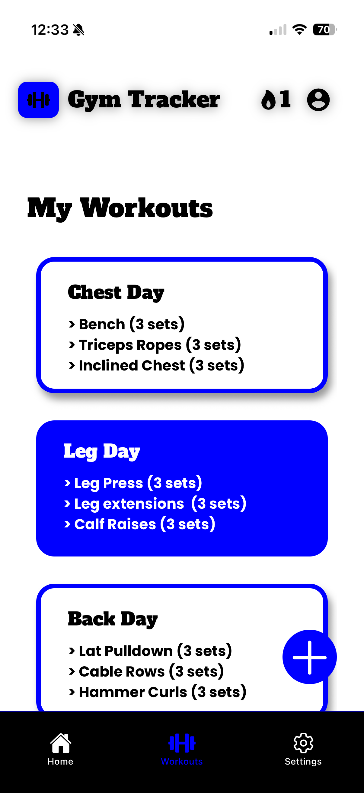
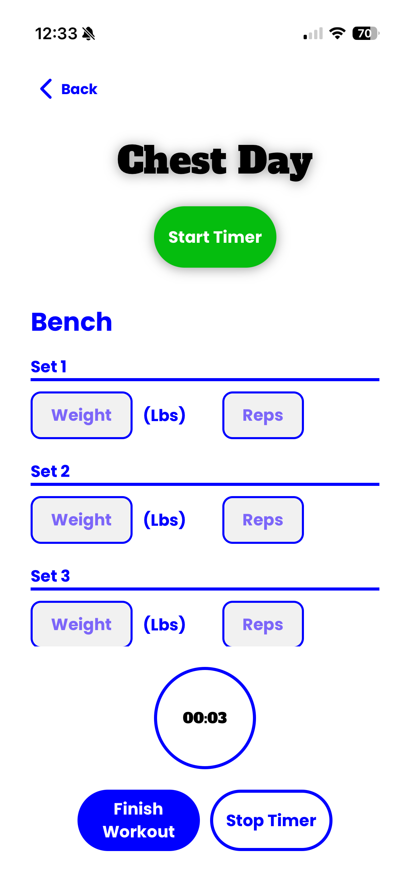

 GymTracker 💪🏋️


## What is GymTracker?
GymTracker is a mobile app, initially designed for iOS mobile devices, where the user can track their workout journey. \
The user is able to create workouts, track the weight progression, and time a workout session. This is just the beginning of this app, improvements and new functionality are to be added.

## Get started
This is an [Expo](https://expo.dev) project created with [`create-expo-app`](https://www.npmjs.com/package/create-expo-app). \
So to get started:
1. Install dependencies

   ```bash
   npm install
   ```

2. Start the app

   ```bash
   npx expo start
   ```

In the output, you'll find options to open the app in a

- [development build](https://docs.expo.dev/develop/development-builds/introduction/)
- [Android emulator](https://docs.expo.dev/workflow/android-studio-emulator/)
- [iOS simulator](https://docs.expo.dev/workflow/ios-simulator/)
- [Expo Go](https://expo.dev/go), a limited sandbox for trying out app development with Expo


## App Guide

### Login & Account Creation

The first screen users see is the Login screen, where they can either log into an existing account or create a new one.

<p align="center">
  
</p>

When creating an account, the application collects the user’s first name, last name, email, and password. After creating an account, users are asked to provide additional information such as body weight, height, and date of birth. This information allows GymTracker to provide a more personalized experience.

### Home Screen

After logging in, users are taken to the Home screen, which serves as the main hub for the application.

<p align="center">
  
</p>

From the Home screen, users can access their workouts and application settings.

### Creating a Workout

Users can create their own custom workouts by adding exercises and configuring their workout routine.

<p align="center">
  
</p>

### Workout Tracking

Once a workout has been created, users can access it through the Workout screen and track their progress throughout the session.

<p align="center">
  
</p>

Users can record the weight and repetitions for each exercise, allowing them to keep track of their progression over time.

### Starting a Workout

GymTracker also includes a dedicated workout session screen where users can actively track their workout and use the built-in timer.

<p align="center">
  
</p>

## About This Project

I originally developed GymTracker as a project for my Software Engineering class at Oakland Community College. I chose React Native because of its flexibility for mobile application development, despite having little to no prior experience with the framework.

Throughout this project, I developed new skills, became much more familiar with React Native and JavaScript, and gained experience working with databases and cloud-based data storage.

I initially used SQLite for data storage before transitioning to Firebase to provide better scalability and cloud data storage. This also gave me hands-on experience retrieving, manipulating, and managing user-specific data.

One of the biggest challenges throughout development was learning a new framework while simultaneously building the application. I used AI tools, documentation, and online learning resources as supplemental learning tools to help me understand unfamiliar concepts, troubleshoot problems, and improve my programming skills.

Overall, this project gave me practical experience with mobile application development, database management, authentication, cloud storage, and software development practices.
